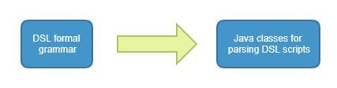
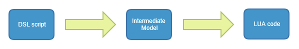

# A DSL with LUA code generation
 
## Overview

This project demonstrates transformation of a [DSL](https://en.wikipedia.org/wiki/Domain-specific_language) 
into [LUA](https://www.lua.org/) code.

The [DSL](https://en.wikipedia.org/wiki/Domain-specific_language) is defined using a 
[grammar](https://github.com/antlr/antlr4/blob/master/doc/grammars.md) (*.g4) file. 
The parser for this [grammar](https://github.com/antlr/antlr4/blob/master/doc/grammars.md) 
is generated automatically by [ANTLR](https://github.com/antlr/antlr4) from 
the .g4 [grammar](https://github.com/antlr/antlr4/blob/master/doc/grammars.md), 
at compile time. At run time, we transform a script the follows the
[DSL](https://en.wikipedia.org/wiki/Domain-specific_language)'s specification, 
into executable [LUA](https://www.lua.org/) code, with the help of
[FreeMarker](http://freemarker.org/) templates.

##### Compile time



##### Run time

 

## The [DSL](https://en.wikipedia.org/wiki/Domain-specific_language)

Valid scripts include a collection of rules that have the form `if <predicate> then <action>`.
Preciates are comparisons such as `height < 30`, `weight >= 40` or `age >= 6`, 
and actions are only `accept` and `reject`.

See [1.rules](src/main/resources/dsl-scripts/1.rules) for an example of a valid script:

    if age < 50 then accept
    if height >= 180 then reject
    if weight == 40 then accept
    
The formal [grammar](https://github.com/antlr/antlr4/blob/master/doc/grammars.md) for our 
[DSL](https://en.wikipedia.org/wiki/Domain-specific_language) 
is in the file [IfThen.g4](src/main/antlr4/com/github/adilevin/IfThen.g4):

    grammar IfThen;
    prog : conditional * ;
    conditional : 'if' predicate 'then' action ;
    predicate : measurement comp value ;
    measurement: 'age' | 'height' | 'weight' ;
    comp : '<' | '>' | '<=' | '>=' | '==' | '~=' ;
    value : NON_NEGATIVE_NUMBER ;
    action : 'accept' | 'reject' ;
    WS : [ \t\r\n]+ -> skip ; // skip spaces, tabs, newlines
    
    NON_NEGATIVE_NUMBER : [0-9]+ ;

## The use of [LUA](https://www.lua.org/) for executing the rules

The [LUA](https://www.lua.org/) code runs through the generated rules, and stops when one rule returns
an `accept` or `reject` decision. As output, we get not only the decision, but also information the
reasoning behind the decision, i.e. which rule was fired to trigger that decision. 

## How to build the project and generate the [DSL](https://en.wikipedia.org/wiki/Domain-specific_language) parser

Assuming you have [Maven](https://maven.apache.org/) installed, run

    mvn clean package
    
From the project folder. This includes invoking the `antlr4` goal, which generate the code for parsing the DSL,
under the folder `target/generated-sources/`, provided by [Antlr4 Maven plugin](https://mvnrepository.com/artifact/org.antlr/antlr4-maven-plugin). 
Notice the `<visitor>` and `<listener>` options in [pom.xml](pom.xml), which cause the generation of [Visitor 
base classes, as opposed to the Listener pattern](https://stackoverflow.com/questions/20714492/antlr4-listeners-and-visitors-which-to-implement).   

The `antlr4` goal can also be invoked separately, by running

    mvn antlr4:antlr4
    
in the project folder, or by invoking the goal `antlr4:antlr4` under `Plugins -> antlr4` in the `Maven Projects` window in IntelliJ. 
    
## How to run the [LUA](https://www.lua.org/) code generator

Assuming you have [Maven](https://maven.apache.org/) installed, run the class [App](src/main/java/com/github/adilevin/App.java) by typing

    mvn exec:java -Dexec.mainClass="com.github.adilevin.App"
    
in the project folder. 

This will read the [DSL](https://en.wikipedia.org/wiki/Domain-specific_language)
script in the resource file [/dsl-scripts/1.rules](src/main/resources/dsl-scripts/1.rules)
 
    if age < 50 then accept
    if height >= 180 then reject
    if weight == 40 then accept 
 
and will turn it into [LUA](https://www.lua.org/) code, generating the file [rules.lua](rules.lua):

```lua
-- This code was auto-generated using ANTLR4

return {

  { ["pred"] = function(person)
      return (person.age < 50)
    end,
    ["action"] = "accept",
    ["text"] = "if age < 50 then accept" },

  { ["pred"] = function(person)
      return (person.height >= 180)
    end,
    ["action"] = "reject",
    ["text"] = "if height >= 180 then reject" },

  { ["pred"] = function(person)
      return (person.weight == 40)
    end,
    ["action"] = "accept",
    ["text"] = "if weight == 40 then accept" },

}
```

## How to execute the [LUA](https://www.lua.org/) code

As a prerequisite, install [LUA](https://www.lua.org/). Windows users - install from [here](https://github.com/rjpcomputing/luaforwindows/releases). After generating the [LUA](https://www.lua.org/) code, run the following command in the project folder:

    lua main.lua
    
Notice that [main.lua](main.lua) "require"s [rules.lua](rules.lua).